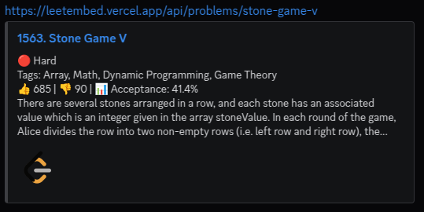

# 🔗 LeetEmbed

LeetEmbed is a simple service that generates **Discord previews** for [LeetCode](https://leetcode.com) problems.  
Just paste a LeetCode problem link with the `leetembed.vercel.app` domain and it will automatically show a nice Open Graph preview with:

- ✅ Problem number and title  
- ✅ Difficulty (Easy / Medium / Hard) with emoji  
- ✅ Tags (Array, DP, Graph, etc.)  
- ✅ Short description (cleaned, trimmed before examples)  
- ✅ LeetCode logo  

---

## ✨ Example

Paste this in Discord:

https://leetembed.vercel.app/api/problems/stone-game-iv

And you’ll get a preview like:

## 🛠️ Notes
- Description is truncated automatically by Discord.  
